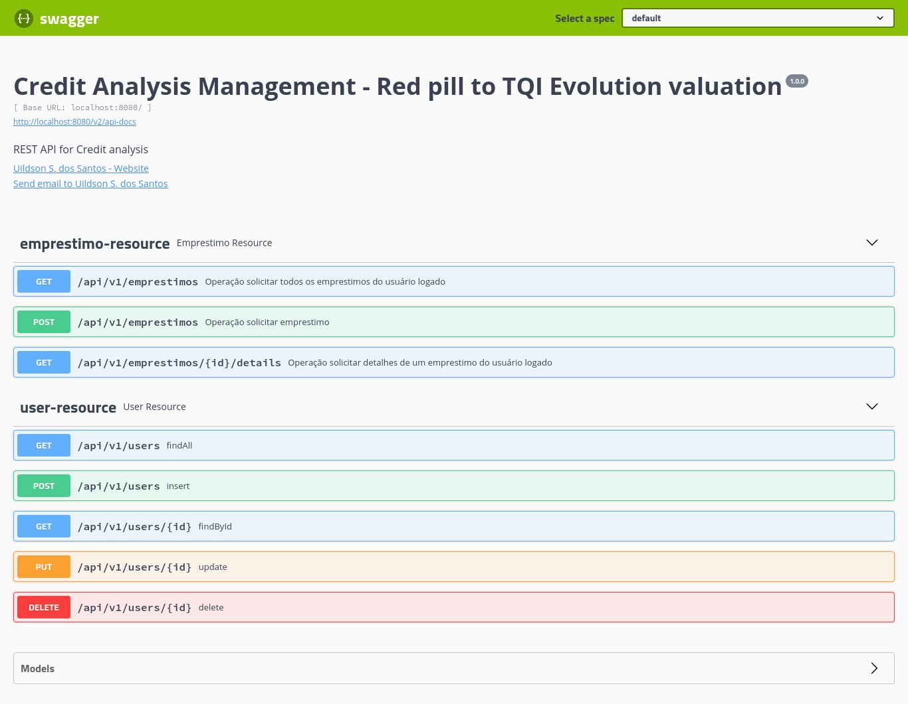

# Credit Analysis Management - Red pill to TQI Evolution valuation

- Basic requirements

  - Java version 11.0.10
  - Node version 14.17.1
  - NPM version 6.14.13
  - YARN version 1.22.11

## How to start the project

## STEP 1: Download this repository

```bash
  git clone https://github.com/UildsonSantos/tqi_evolution_backend_2021
```

## STEP 2: Start the Backend

Access the directory .../tqi_evolution_backend_2021/

Open a terminal, and run

```bash
mvn clean package
```
After...
```bash
cd target/
```
and to start the Backend server

```bash
java -jar creditmanager-0.0.1-SNAPSHOT.jar 
```


## STEP 3: Start Postman

* Config variables :
  * client-id: myclientid
  * client-secret: myclientsecret


## STEP 4: Simulate the Project

## Login: 

### Access the resource 

```html
http://localhost:8080/oauth/token
```


- user profile ADMIN:

  - username: ana@gmail.com

  - senha: 123456


- user profile CLIENT:

  - username: bob@gmail.com

  - senha: 123456


## Other resources 



## Resumo das funcionalidades

Uma empresa de empréstimo precisa criar um sistema de análise de crédito para fornecer aos seus clientes as seguintes funcionalidades:

* i. Cadastro de clientes

    O cliente pode cadastrar: nome, e-mail, CPF, RG, endereço completo, renda e senha.
* ii. Login

    A autenticação será realizada por e-mail e senha.
* iii. Solicitação de empréstimo

    Para solicitar um empréstimo, precisamos do valor do empréstimo, data da primeira parcela e quantidade de parcelas.
    O máximo de parcelas será 60 e a data da primeira parcela deve ser no máximo 3 meses após o dia atual.
* iv. Acompanhamento das solicitações de empréstimo

    O cliente pode visualizar a lista de empréstimos solicitados por ele mesmo e também os detalhes de um de seus empréstimos.
    Na listagem, devemos retornar no mínimo o código do empréstimo, o valor e a quantidade de parcelas.
    No detalhe do empréstimo, devemos retornar: código do empréstimo, valor, quantidade de parcelas, data da primeira parcela, e-mail do cliente e renda do cliente.


#tqi_evolution_avaliacao